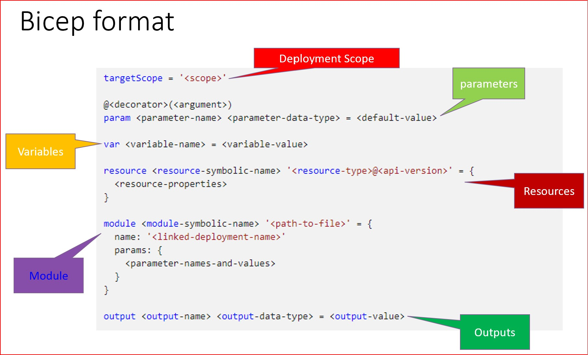
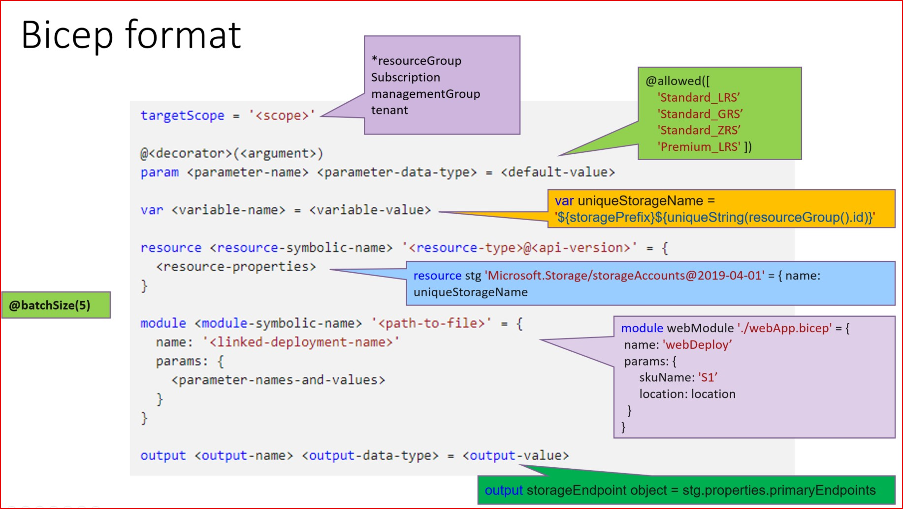

# azure-iac
automate provisioning on azure by using terraform and bicep


### Github Actions with infrastructure-as-code on Azure

Github Actions workflows to provision Azure resources with infrastructure as code - bicep and terraform
Under .github/workflows/, there are sample workflows for bicep and terraform

To provision Azure resources through github actions, you need service principal and set it on the Github Secrets. 

##### Create Azure Service Principal
```
#### Create Service Principal 
az ad sp create-for-rbac --name sp_tf_ghaction --sdk-auth

#### or Create Service Principal with the contributor role on subscription level
az ad sp create-for-rbac --name sp_tf_ghaction --role Contributor --scopes /subscriptions/{subscriptionId} --sdk-auth
```

##### Saving Service Principal credentials within GitHub Repository as secrets
>  Add 3 secrets on Github under repository > "Settings" > "secret" > "Actions"
```
  AZURE_AD_CLIENT_ID – Will be the service principal ID from above
  AZURE_AD_CLIENT_SECRET – The secret that was created as part of the Azure Service Principal
  AZURE_AD_TENANT_ID – The Azure AD tenant ID to where the service principal was created
  AZURE_SUBSCRIPTION_ID – Subscription ID of where you want to deploy the Terraform
  AZURE_CREDENTIALS - Paste the whole output of JSON format
```

### Bicep
**Bicep** is the Azure-native infrastructure-as-code language. 
Bicep consists of simplified declarative languages that can be transfiled with ARM tamplate. 

> Under bicep directory, there is sample bicep file to deploy Storage Account to "Lab" resource group. 
> 
> You can modify the resource group and storage account prefix on the main.bicep
> 
> When there is any update on **bicep** directory, Github Action workflow (**.github/workflows/bicep_whatif.yml**) will run to check the execution plan. 

##### bicep command
```
### install bicep
az bicep install 

### you will get json format output file
az bicep build --file {bicep_file} --outfile {out_file} 

### you can get bicep file through arm template
az bicep decompile --file {json_template_file} 
```

##### bicep format 



### Terraform 
> Under terraform directory, there is sample terraform configuration files. 
> 
> When there is any update on **terraform** directory, Github Action workflow (**.github/workflows/terraform_play.yml**) will run to check the execution plan. 
> 
> **.github/workflows/terraform_apply.yml** will run manually.

#### Create a storage account and a blob container to hold the state file
> Use below script to create a Azure storage account (or see azure docs)

```
RESOURCE_GROUP_NAME=tfstate
STORAGE_ACCOUNT_NAME=tfstate$RANDOM
CONTAINER_NAME=tfstate

# Create resource group
az group create --name $RESOURCE_GROUP_NAME --location uksouth

# Create storage account
az storage account create --resource-group $RESOURCE_GROUP_NAME --name $STORAGE_ACCOUNT_NAME --sku Standard_LRS --encryption-services blob

# Get storage account key
ACCOUNT_KEY=$(az storage account keys list --resource-group $RESOURCE_GROUP_NAME --account-name $STORAGE_ACCOUNT_NAME --query [0].value -o tsv)

# Create blob container
az storage container create --name $CONTAINER_NAME --account-name $STORAGE_ACCOUNT_NAME --account-key $ACCOUNT_KEY

echo "storage_account_name: $STORAGE_ACCOUNT_NAME"
echo "container_name: $CONTAINER_NAME"
```

#### Create a terraform block in `providers.tf` to include the backend configuration 
> terrform configuration on the repository
> From `contoso/main.tf`, add the following to begining of the file and fill it with your storage account details.

```
terraform {
  backend "azurerm" {
    resource_group_name   = "tfstate"
    storage_account_name  = "<your_storage_account_name>"
    container_name        = "tfstate"
    key                   = "terraform.tfstate"
  }
  required_providers {
    azurerm = {
      source  = "hashicorp/azurerm"
      version = "=3.0.0"
    }
  }
}
```

